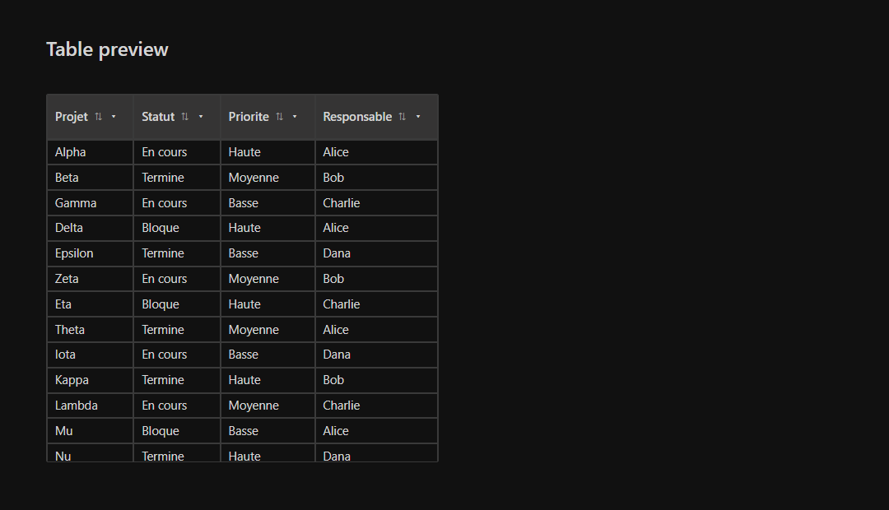

# Markdown Tables Extended

Adds interactive tables to VS Code's built-in Markdown preview.



## Features

- Sticky table headers while scrolling large Markdown tables.
- Column filter popovers from each header.
- Multi-value filters with search.
- Clickable column sorting.
- Manual column resizing.
- Fast table view for large Markdown files.
- Works in the native Markdown preview.

## Installation

Build a VSIX package from this folder:

```powershell
npm install
npm run package
```

This creates a file like:

```text
markdown-tables-extended-0.0.1.vsix
```

Install it from the command line:

```powershell
code --install-extension .\markdown-tables-extended-0.0.1.vsix
```

Or install it from VS Code:

1. Open the **Extensions** view.
2. Click the `...` menu.
3. Choose **Install from VSIX...**.
4. Select the generated `.vsix` file.

After installation, open a Markdown file and run:

```text
Markdown Tables Extended: Open Enhanced Preview
```

For large Markdown files, use the memory-backed virtualized table viewer instead:

```text
Markdown Tables Extended: Open Fast Table View
```

If sorting, filtering, or resizing controls do not appear, allow scripts in the Markdown preview:

```text
Markdown: Change Preview Security Settings
```

## Usage

1. Open a Markdown file in VS Code.
2. Run **Markdown Tables Extended: Open Enhanced Preview**.
3. Click a column header to sort it.
4. Click the arrow button in a table header to filter that column.
5. Drag a column border in the header to resize it.

Preview scripts are only enabled by VS Code when the workspace and content settings allow scripts in Markdown previews.

For very large files, **Open Fast Table View** extracts Markdown tables in memory and renders only the visible rows. This avoids creating thousands of DOM rows at once.

The fast view updates automatically when the source Markdown document changes. Changes are debounced while editing and refreshed immediately on save.

## Development

```sh
npm install
npm run lint
```

Press `F5` in VS Code to launch an extension development host.
